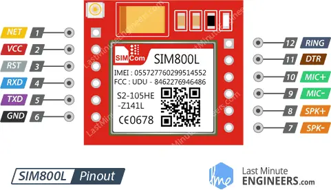

# ESP32 Firmware for Capstone Project

## SIM800L test configurations
Since SIM800L module is kind of hard to test and debug, let alone make it works properly, this is an effort to see things more clearly.
### SIM800L pinout and wirings
The connections are as follows:
- VCC to BAT+
- RESET to BAT+ (or BAT- if you want to reset in the middle of testing)
- RXD to ESP32_TX2 (17)
- TXD to ESP32 RX2 (16)
- GND to BAT



### SIM800L issues
- The issue that I was facing is that the module was constantly restarting, with repeating output similar to these when `#define DUMP_AT_COMMANDS` are enabled/uncommented.
```
RDY

+CFUN: 1

+CPIN: READY

Call Ready

SMS Ready
```
- When that happens, it means that the module is restarting on its own.
- Occasional warning such as these:
```
UNDER-VOLTAGE POWER DOWN
```
or
```
UNDER-VOLTAGE WARNNING
```
in conjunctions with the restarting behavior of the module may also happen.
- Kindly notice the 1000 uF capacitor is used to filter 2 amperes of transient spike that the SIM800 module produce when trying to connect. This often helps, but sometimes it doesn't :(.

### ESP32 configurations and wirings
To make connections between ESP32 and SIM800 works, since they use UART, they have to have **a common ground**.

To upload code:
- Make sure ESP32 is not connected to battery
- Connect to computer with USB cable
- Upload the code

And then, to let the system run:
- Disconnect the USB cable
- Connect ESP32 VIN and GND to battery module 5V and GND respectively
- Reconnect the USB cable so that you are able to debug from serial monitor

Reference:
- https://drive.google.com/file/d/19UxkkifQDwHhEvOkkO_yIXxYYQnAupFo/view?usp=sharing
- https://drive.google.com/file/d/19Wf8XxCUDNx_fklVCsJIVnZNRKKjZC-i/view?usp=sharing

### Code
- Kindly notice that the code for testing **IS NOT ON THIS BRANCH (NOT ON `main` BRANCH)** and is located in **`test/sim800l-mqtt` branch** instead, so that this `main` branch is free from test codes.
- It is recommended to enable/uncomment `#define DUMP_AT_COMMANDS` to be able to see what the SIM800 module output.
